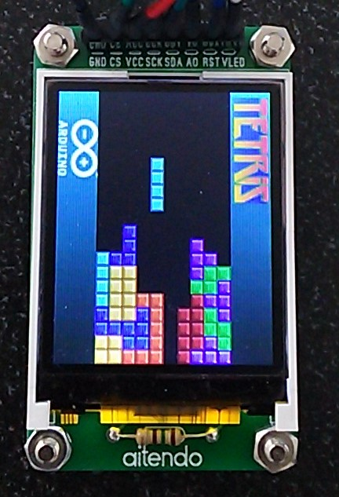
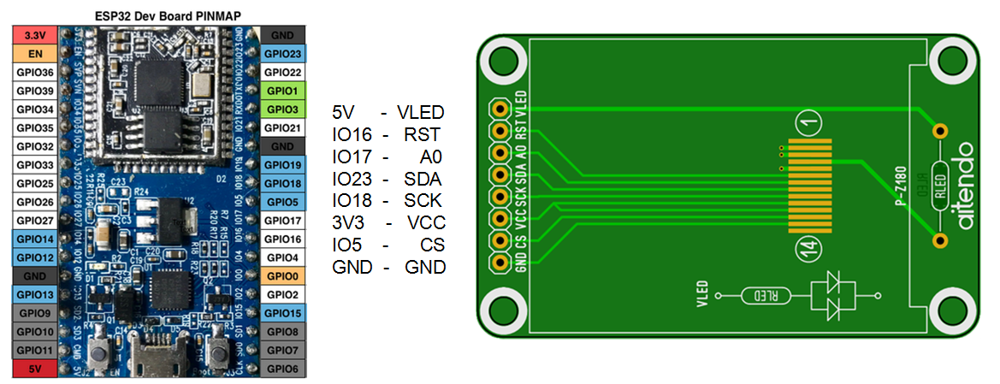
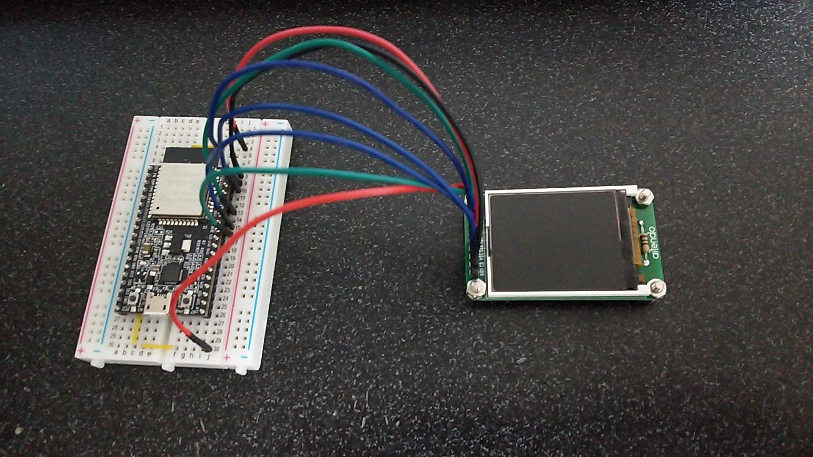

# esp32_ST7735_Tetris

## Prepare
- [ESP32-DevKitC](http://akizukidenshi.com/catalog/g/gM-11819/) ESP32 : 秋月電子
- [M-Z18SPI-2PB](http://www.aitendo.com/product/15420) TFT color LCD : Aitendo

## Wiring

## Development Environment
- [Arduino IDE](https://www.arduino.cc/en/main/software)
- [arduino-esp32](https://github.com/espressif/arduino-esp32)

## Coding reference
- [【ゆっくり解説】 テトリスの作り方 【ゲームプログラミング】](http://www.nicovideo.jp/watch/sm17983957)

## Controller
You can use SerialPort or [WiFi TCP/UDP Controller](https://play.google.com/store/apps/details?id=udpcontroller.nomal&hl=ja) as the controller. Buttons UP, RIGHT, DOWN, and LEFT are each assigned on characters '8', '6', '2', and '4' in the both case of SerialPort and WiFi UDP. You can set configuration by loading "WiFi_UDP_Controller_config.txt" for WiFi TCP/UDP Controller.
